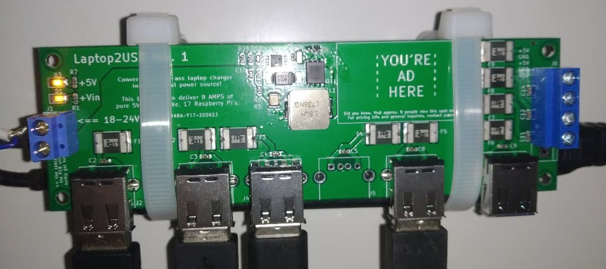

# laptop2usb

### The premises
 
  * In tech-oriented public spaces there's constant shortage of wallplug USB chargers
  * The notebooks' powerbricks generally outlive the notebooks themself, so with enough effort you may get one for free
 
### How do I?

You fasten the PCB to a powerbrick.

The device takes anything between 17-20V, converts it into 5V, and splits into multiple USB and screw terminal ports. All of these ports are polyfuse-protected.

### Status

I'm yet to check a couple of things, and will do rev.2:
  * The converter gets super hot right now - is this OK? Calculate and document thermal resistance stuff. Verify converter efficiency.
  * Is the 10 mOhm current-limiting resistor even working?
  * The future is now - add USB C?
  * Maximum current it can handle (it was designed for 8A max, but I doubt it'll survive that for long)
  * Are USB ports wired properly? Do android/iOS/raspberry PIs utilize it well enough?
  * Now check the first letters of the list

### Trivia

I ordered the prototype from JLCPcb, with passive elements surface mounted. Their online tool automatically assigns the elements from BOM into the part numbers from their store. Apparently it parsed the shunt 10mOhm resistor as 10 Mega Ohms. 

With 10MegaOhms in the power path, the LM25085 somehow managed to produced 4V output with enough current to shine an onboard LED. Now that's dedication.
